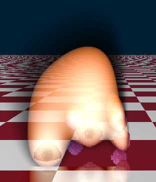

# Extension: RayMarching
## Info
Author: Filip Rechtorík
Namespace: FilipRechtorik
Class name: MarchingCubes
ITimeDependent: No
SourceFiles:
 - ``MarchingCubes.cs`` (legacy)
 - ``Texture3D.cs``
 - ``Fire.cs``
 - ``Volume.cs``
Example scene: ``RandomVolumeScene.cs``
## About the extension
This extension implements two way of rendering 3D textures.

First, class ``Volume`` (inheriting ``Texture3D``) uses ray marching to render the texture as a volume. The 3D texture is located inside of a cube with size 1 in all directions. Values in the texture indicate the _fullness_ of that area. Values 0.5-1.0 indicate that there is a _ball volume_ at that point.

This behavior is created by overriding the ``Intersect(...)`` method. If we imagine the 3D texture as a grid, then we march the ray through all the elementar cubes (texels) along our ray. At each texel, we check the distance to corners and compare it to radiuses at those corners. On top of that, we use blending to blend the distance values, which creates the effect of our balls blending into a single volume.

Second class, ``Fire`` (also inheriting ``Texture3D``) renders the texture as plasma. It marches the ray through the volume at constant steps, sampling the values, and adding them together. There is a threshold for the start of smoke and a threshold for the start of plasma.
This is how the final color is created:
Inside of our ``Intersect(...)`` method, we march the ray throught the texture, and..
1. If the value is a smoke, add it to a smoke factor. Smoke blocks light with by multiplying the colors by (smoke base)^(smoke factor). Meaning that each part of smoke blocks a % of incoming light.
2. If the value is a plasma, sample the plasma color from class ``PlasmaColor`` (a simple gradient from red-ish to yellow-white-ish), multiply that color by smoke, and add it to the output color.

``Fire`` is an animated node that can operate in 3 modes, depending on its ``FuelType``. If the value is ``Fuel.Point`` or ``Fuel.Floor``, it will simply set constant plasma values to either a point on the floor or the whole floor. If the value is ``Fuel.Volume`` then it will use included ``Volume`` as a fuel.

Rendering of ``Fire`` with ``Volume`` works in following way. ``Fire.Intersect`` will first intersect the included ``Volume`` to measure how far it should send the sampling ray. That will result in smaller part of plasma being sampled (until it would hit the volume). Then, in our ``Fire.RecursionFunction``, we render the fire semi-transparent and send a new ray inside the plasma. This ray will hit the ``Volume`` which is a sibling in its node graph. __Important:__ When we have a ``Volume`` as our fuel, we have to pack ``Fire`` together with the ``Volume`` in a class ``FireSimulation`` and use that as our node!

To simulate ``Fire`` in time, we simulate through fixed time steps.
1. We apply force. Force is a combination of class ``Wind``, creating a simple variation in the force field based on time and position, and a constant force up. We take each point in our plasma texture and move it along that force vector. Then we spread it around (since it lands in between points) in an inverse way to texture sampling.
2. We dissipate the plasma by applying a simple blur filter.
3. We fuel the fire. ``Fuel.Point`` and ``Fuel.Floor`` are already described above. ``Fuel.Volume`` works by adding a plasma to the edges of its volume (customizable with ``Fire.FuelPlasmaIntensity``). We also clear the plasma values inside the volume and then burn the fuel depending on the strength of plasma at that position (cusomizable with ``Fire.FuelBurnRate``).

## Usage
To use ``Volume``, you simply create an instance of class ``Volume`` and fill it. You can use several included randomization options to help you out (``CloudsRandomize``, ``PointsRandomize``, ``FuelRandomize``).
To use ``Fire``, you do the same. By default, ``Fire.FuelType`` is ``Point`` (unless you construct it with ``Volume`` in constructor).
To use ``Fire`` with ``Volume`` together, you have to pack them together in a class ``FireSimulation`` and use that node.
## Examples
There is a sample scene ``FireScene.cs`` which uses the ``FireSimulation``.

