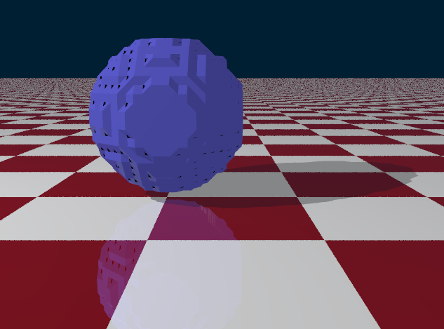
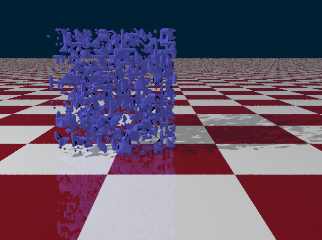

# Extension: MarchingCubes
## Info
Author: Filip Rechtorík
Namespace: FilipRechtorik
Class name: MarchingCubes
ITimeDependent: No
SourceFile: ``MarchingCubes.cs``
Example scene: ``RandomVolumeScene.cs``
## About the extension
The extension is about implementing a way to render 3D texture using technique known as "marching cubes".

The class MarchingCubes creates a 3D grid. Content of the grid are values 0.0 to 1.0. 0.0-0.5 means empty. 0.5-1.0 indicates "fullness" of that area. The grid is inside a cube of side 1.

The main thing my class does is that it override the ``Intersect(...)`` method. Inside this new intersect method, it sends a ray through a grid. Firstly, it finds all the little cubes of the grid that the ray passes through. Then it goes through all of those little cubes and uses the information from their corner fulness to find the intersection of that small cube.

The intersection of that cube is done by looking at which corners are at least 0.5 full and then selecting the proper function to find the intersection. For example, one corner only means that it's a triangle around that corner. Two neigbour corners full mean that it's a triangular prism (or a cut through a triangular cone of the radiuses of the corners differ). In general, take the value of that corner, go the distance of that (radius - 0.5) by each axis, and these points are going to make the shape.

The difficulty of this was in the amount of shapes that can be created by various combinations of corners that are full or empty. In the end I ended up with 9 different functions that find the shnape and create the appropriate triangles from it. Originally I planned to create a round surfaces, but after reaching surfaces defined by 4 or more corners, it started to become too difficult. In the end I decided to go with simple triangles.
## Usage
To use the extension you simply create an object ``MarchingCubes``. Then you need to set the values of the grid like this: ``marchingCubes[1,1,1] = 0.5`` and so on. For testing there are three methods that fill the shape in some way: ``Fill()``, ``Sphere()``, and ``Randomize()``.
## Examples
There is a simple example of ``RandomVolumeScene.cs``. This scene simply creates a ``MarchingCubes`` of size 20 in each direction and randomizes it's content. There is also ``SphereVolumeScene.cs``.

